# نظام حجز المواعيد — Appointment System

تطبيق Flutter لحجز المواعيد في مستشفى، يعمل على Firebase ويدعم العربية والإنجليزية.
يعمل على **Android** و**الويب**.

## المميزات

- **ثلاثة أدوار:** مريض، طبيب، ومدير — لكل دور شاشته الخاصة.
- **حجز بلا تعارض:** لا يمكن لمريضين حجز الوقت نفسه عند الطبيب نفسه، حتى لو ضغطا معاً.
- **توثيق البريد الإلكتروني:** لا يستطيع المريض الحجز قبل تأكيد بريده عبر الرابط المرسل إليه.
- **إشعارات وتذكير:** إشعار عند طلب حجز أو تأكيده أو رفضه، وتذكير قبل الموعد بساعة (على Android).
- **عربي وإنجليزي:** الواجهة كاملة، ورسائل البريد من Firebase، وأسماء الخدمات الافتراضية — كلها بلغة المستخدم.
- **حذف الحساب:** يمكن للمريض حذف حسابه بنفسه بعد إدخال كلمة المرور، وتُلغى مواعيده القادمة تلقائياً.

## لقطات الشاشة

<table>
<tr><td align="center">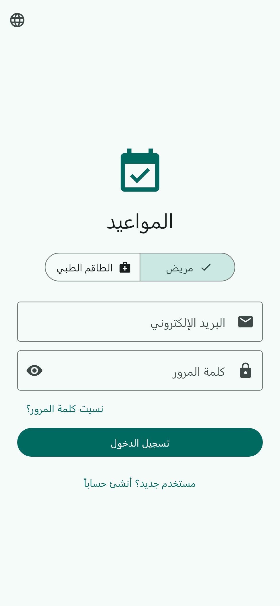<br><sub>تسجيل الدخول</sub></td><td align="center">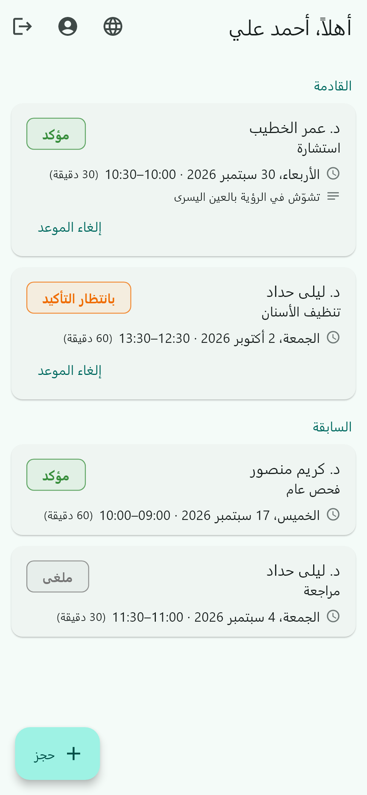<br><sub>المريض: مواعيده القادمة والسابقة</sub></td><td align="center">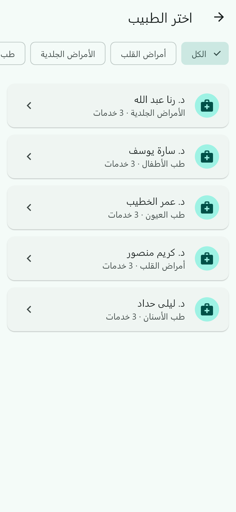<br><sub>المريض: اختيار الطبيب حسب القسم</sub></td></tr>
<tr><td align="center">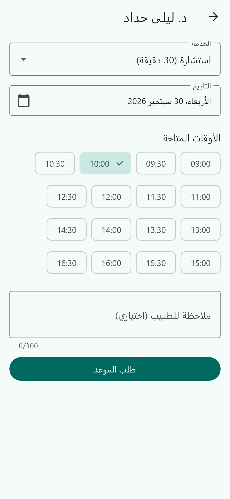<br><sub>المريض: حجز موعد</sub></td><td align="center">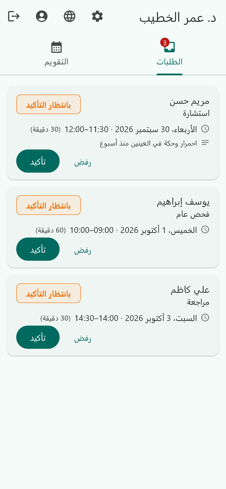<br><sub>الطبيب: طلبات الحجز</sub></td><td align="center">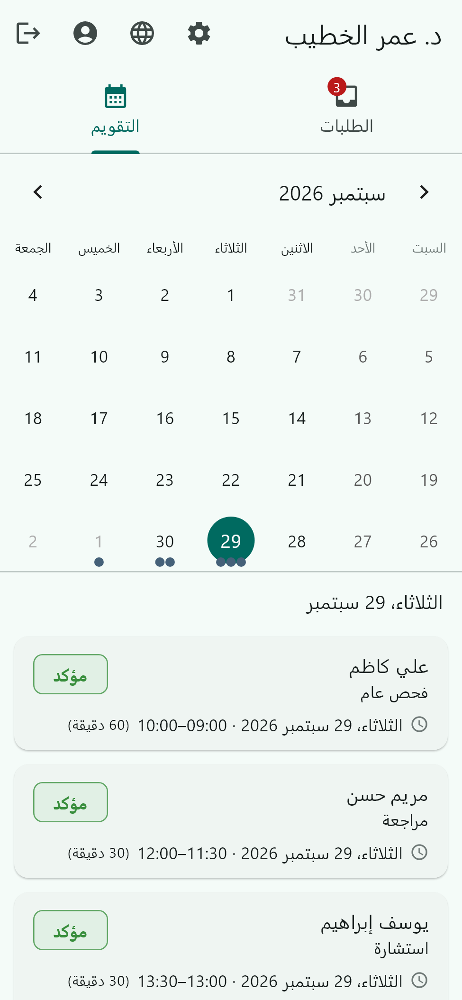<br><sub>الطبيب: التقويم</sub></td></tr>
<tr><td align="center">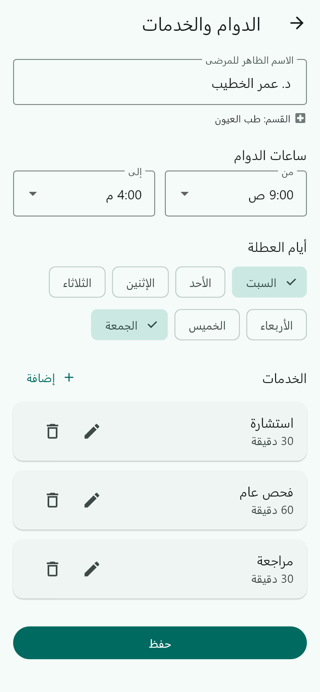<br><sub>الطبيب: الدوام والخدمات</sub></td><td align="center">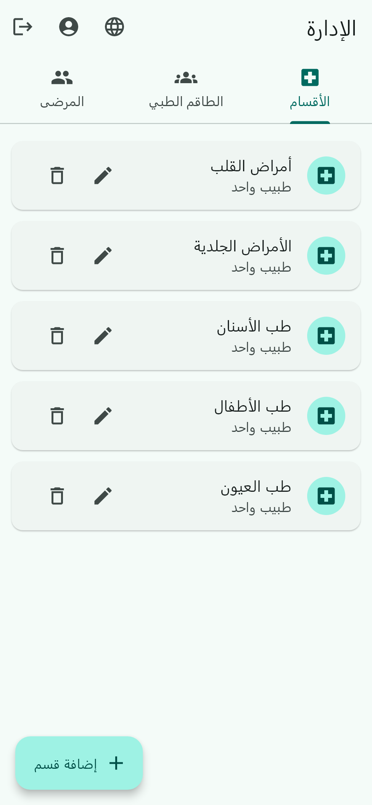<br><sub>المدير: الأقسام</sub></td><td align="center">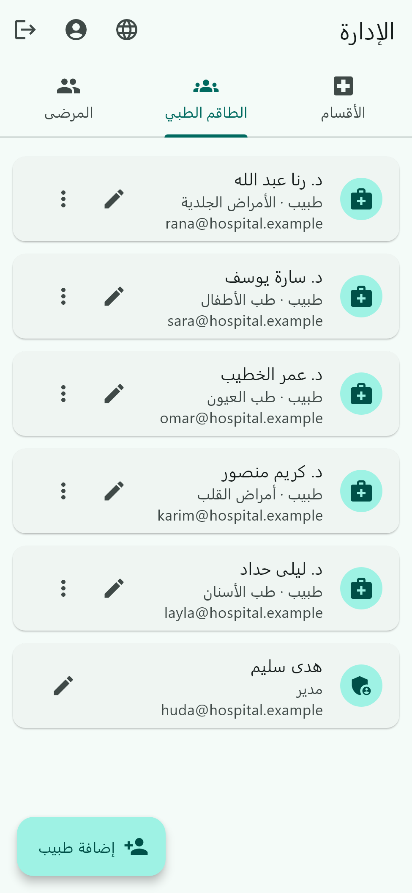<br><sub>المدير: الطاقم الطبي</sub></td></tr>
<tr><td align="center">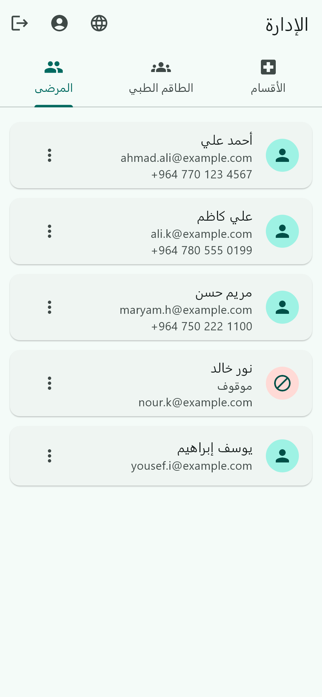<br><sub>المدير: المرضى</sub></td><td align="center">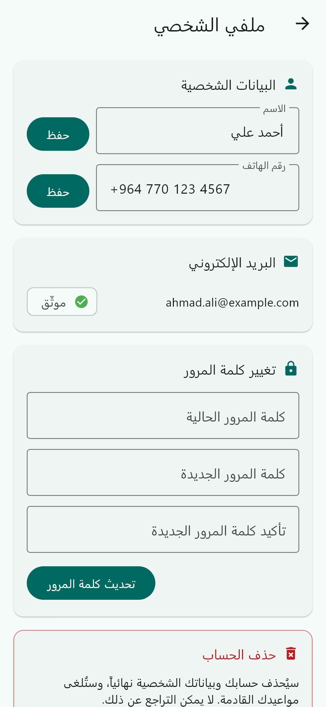<br><sub>الملف الشخصي</sub></td><td align="center">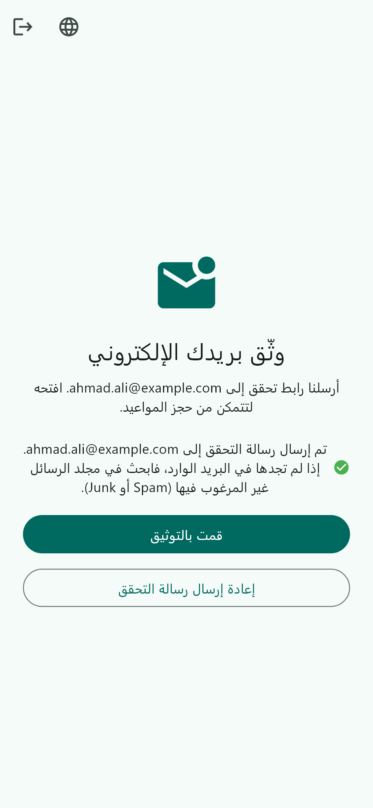<br><sub>توثيق البريد بعد إنشاء الحساب</sub></td></tr>
<tr><td align="center">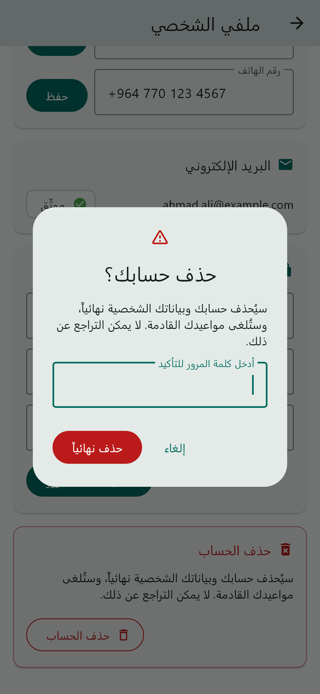<br><sub>المريض: حذف الحساب</sub></td></tr>
</table>

<details>
<summary>English</summary>

<table>
<tr><td align="center">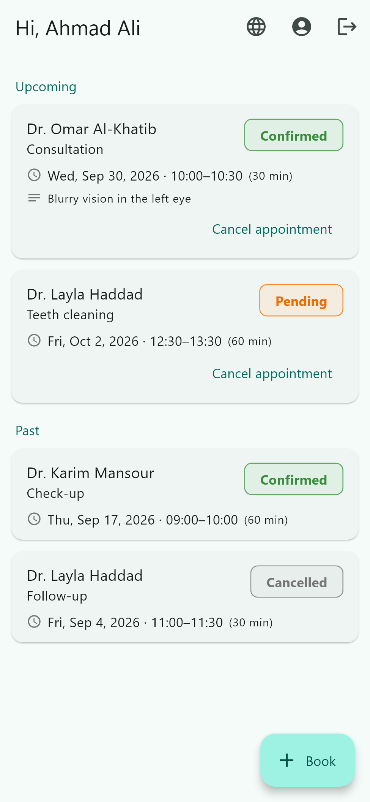<br><sub>Patient home</sub></td><td align="center">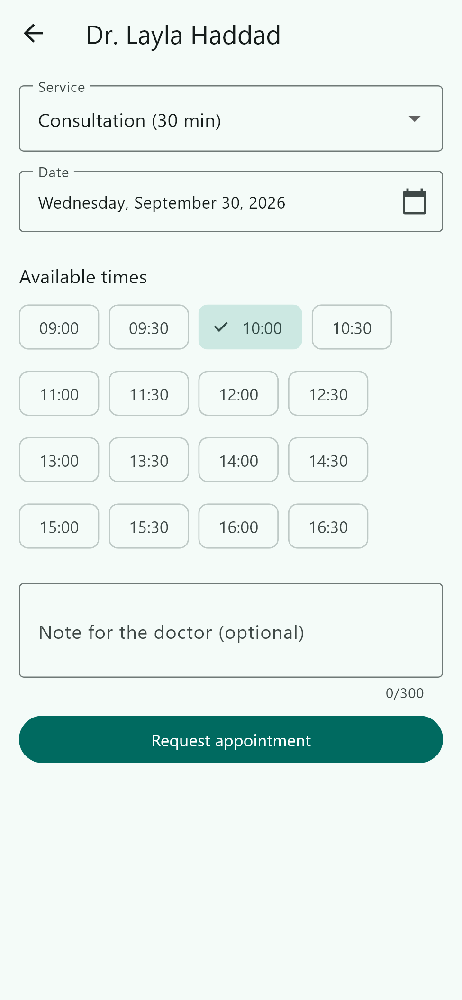<br><sub>Booking</sub></td><td align="center">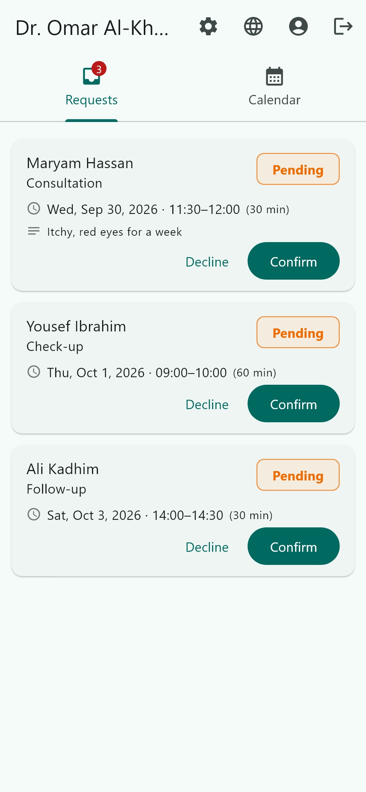<br><sub>Doctor requests</sub></td></tr>
<tr><td align="center">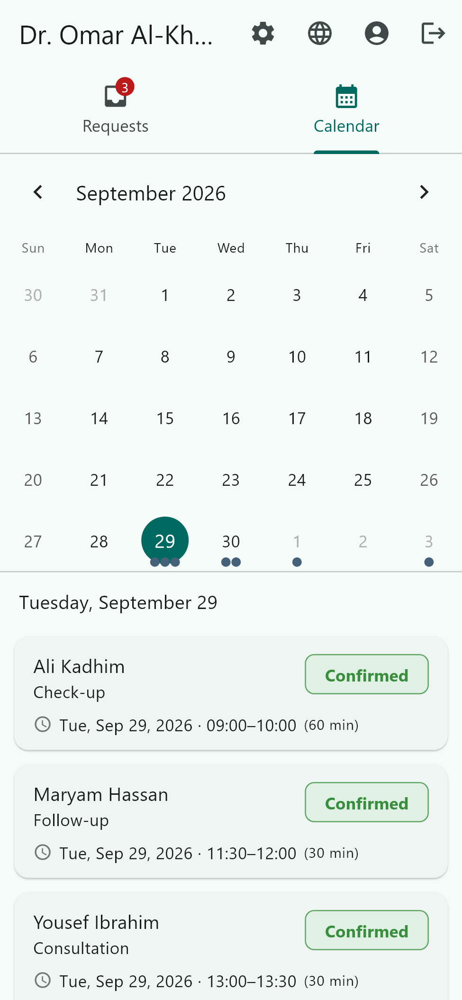<br><sub>Doctor calendar</sub></td><td align="center">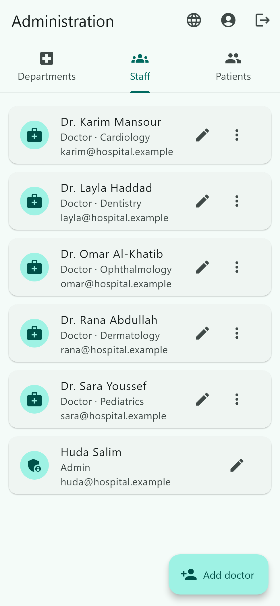<br><sub>Admin: staff</sub></td><td align="center">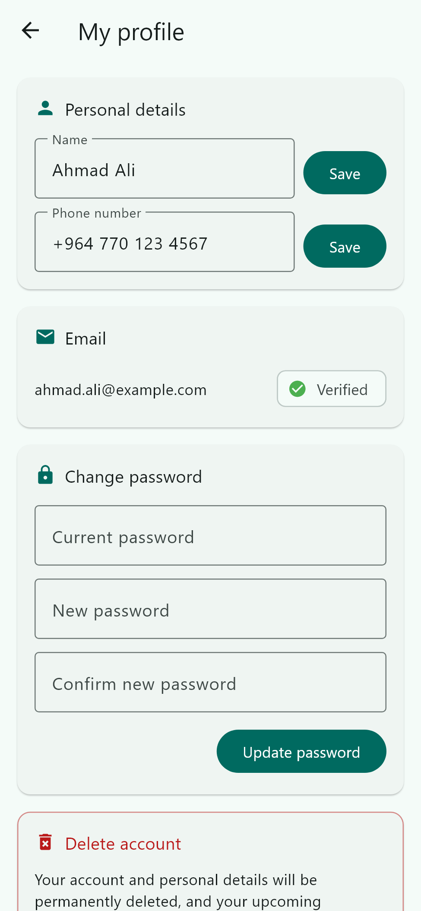<br><sub>Profile</sub></td></tr>
</table>

كل الشاشات بالإنجليزية موجودة في [docs/screenshots/en](docs/screenshots/en).
</details>

اللقطات تُولَّد من التطبيق الحقيقي فوق بيانات تجريبية في الذاكرة (بدون Firebase)،
فيمكن إعادة توليدها بعد أي تعديل على الواجهة بأمر واحد:

```bash
flutter test tool/screenshots --update-goldens
```

الأمر يحتاج خط Segoe UI (موجود في ويندوز) لعرض النص العربي. البيانات التجريبية معرّفة في
[tool/screenshots/screenshots_test.dart](tool/screenshots/screenshots_test.dart).

## الأدوار

| الدور | ماذا يفعل |
|---|---|
| **مريض** (`customer`) | ينشئ حساباً بنفسه ويوثّق بريده، يتصفح الأطباء حسب القسم، يحجز موعداً ويلغيه، ويمكنه حذف حسابه. |
| **طبيب** (`provider`) | يُنشئه المدير. يقبل الطلبات أو يرفضها، يرى جدوله في التقويم، ويضبط ساعات الدوام وأيام العطلة والخدمات. |
| **مدير** (`admin`) | يدير الأقسام، ينشئ حسابات الأطباء، يرقّي طبيباً إلى مدير، ويوقف المرضى أو يحذفهم. |

حسابات الأطباء والمدراء لا تُحذف إلا من قِبل المدير.

## التشغيل

```bash
flutter pub get
flutter run
```

### إعداد Firebase (مرة واحدة)

1. **Authentication ← Sign-in method:** فعّل **Email/Password**.
2. **Project settings ← General ← Public-facing name:** اكتب اسماً واضحاً مثل "نظام المواعيد".
   هذا الاسم يظهر داخل رسائل التحقق وإعادة تعيين كلمة المرور، والاسم الافتراضي
   (`project-123...`) يجعل البريد يبدو مريباً ويزيد احتمال وصوله إلى Spam.
3. **ارفع قواعد الأمان** (وكرّر ذلك بعد أي تعديل على `firestore.rules`):

   ```bash
   firebase deploy --only firestore:rules
   ```

   > على ويندوز، إن ظهر الخطأ `running scripts is disabled on this system` في PowerShell،
   > استخدم `firebase.cmd` بدلاً من `firebase`.

4. **أول حساب مدير:** سجّل في التطبيق كمريض، ثم من **Firestore** افتح المستند `users/{uid}`
   الخاص بك وغيّر الحقل `role` إلى `admin`، ثم سجّل الخروج وادخل من جديد.
   بعدها يُنشئ المدير حسابات الأطباء من داخل التطبيق.

### رسائل التحقق لا تصل؟

- ابحث في مجلد **Spam** (في Gmail) أو **Junk Email** (في Outlook). الأسرع: ابحث عن `firebaseapp`.
- التطبيق يعرض تحت شاشة "وثّق بريدك" نتيجة الإرسال: إما "تم الإرسال إلى …" أو سبب الفشل.
- Firebase يوقف الإرسال مؤقتاً عند الضغط على "إعادة الإرسال" مرات كثيرة؛ انتظر قليلاً ثم حاول مرة واحدة.

## الاختبارات

```bash
flutter analyze
flutter test      # منطق التطبيق + كل الشاشات بقياس هاتف وباللغتين، بدون Firebase
```

بعد تعديل ملفات الترجمة `lib/l10n/*.arb` تُولَّد الملفات تلقائياً مع `flutter run`، أو يدوياً بـ `flutter gen-l10n`.

### لقطات الشاشة

تُولَّد من التطبيق الحقيقي فوق بيانات تجريبية في الذاكرة (بدون Firebase، ولا تلمس أي بيانات حقيقية)،
فيمكن تحديثها بعد أي تعديل على الواجهة:

```bash
flutter test tool/screenshots --update-goldens
```

تُحفظ في `docs/screenshots/{ar,en}/`. الأمر يحتاج خط Segoe UI (موجود في ويندوز) لعرض النص العربي.
البيانات التجريبية معرّفة في [tool/screenshots/screenshots_test.dart](tool/screenshots/screenshots_test.dart).

## بنية المشروع

```
lib/
  main.dart            نقطة البداية، الثيم، واختيار الشاشة الرئيسية حسب الدور
  models/              بيانات بسيطة: الموعد، الطبيب، القسم، المستخدم، إعدادات الدوام
  data/                واجهات المستودعات (abstract) + تطبيقها على Firebase
  state/               AppState: مصدر الحقيقة الوحيد، تصل إليه الشاشات عبر AppScope.of(context)
  screens/             الشاشات الكاملة
  widgets/             عناصر مشتركة: بطاقة الموعد، نوافذ التأكيد، قوائم التحميل، أزرار الشريط
  utils/               رسائل الأخطاء، التحقق من الحقول، ترجمة الخدمات، واتجاه النص
  services/            الإشعارات المحلية والتذكير قبل الموعد بساعة
  l10n/                الترجمة (app_en.arb / app_ar.arb)
test/
  fakes.dart           نسخ وهمية من المستودعات تعمل في الذاكرة
  app_state_test.dart  اختبارات المنطق: الحجز، منع التعارض، حذف الحساب، صلاحيات المدير...
  screens_test.dart    يبني التطبيق الحقيقي ويتنقّل بين شاشاته
  switch_map_test.dart يتأكد أن تسجيل الخروج يصل للتطبيق فوراً
tool/screenshots/      يولّد لقطات الشاشة في docs/screenshots
firestore.rules        قواعد الأمان: من يقرأ ويكتب ماذا
```

## الأمان

الصلاحيات تُفرض في [firestore.rules](firestore.rules) على الخادم، لا في التطبيق فقط:

- المريض لا يرى إلا مواعيده، والطبيب لا يرى إلا المواعيد المحجوزة عنده.
- لا يمكن الحجز بحساب بريده غير موثّق، ولا بحساب أوقفه المدير.
- لا يستطيع أي مستخدم تغيير دوره أو رفع الإيقاف عن نفسه.
- المريض يلغي موعده فقط؛ الطبيب يؤكد أو يرفض أو يلغي.

## كيف يُمنع الحجز المزدوج

كل نصف ساعة محجوزة لها مستند في مجموعة `slots` معرّفه `<طبيب>_<yyyyMMddHHmm>`.
الحجز يكتب الموعد وكل مستندات الـ slots الخاصة به في عملية واحدة (batch)، وقواعد الأمان
لا تسمح بإنشاء مستند slot موجود أصلاً — لذلك إن حاول مريضان حجز الوقت نفسه ينجح واحد فقط.
الرفض أو الإلغاء يحذف هذه المستندات فيعود الوقت متاحاً.

لهذا السبب يجب أن تكون مدة كل خدمة من مضاعفات ٣٠ دقيقة.
